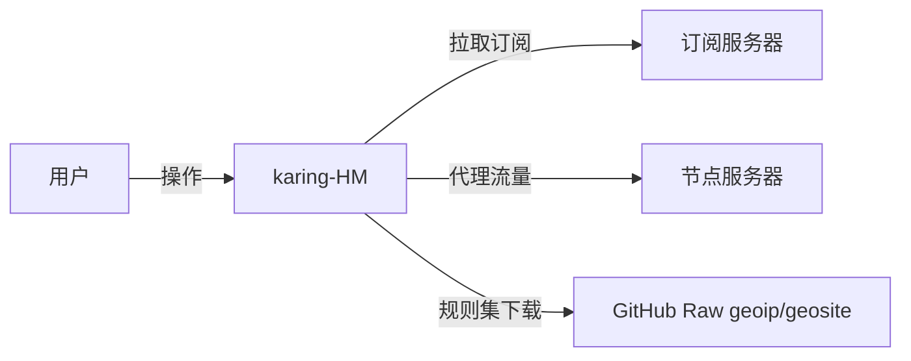
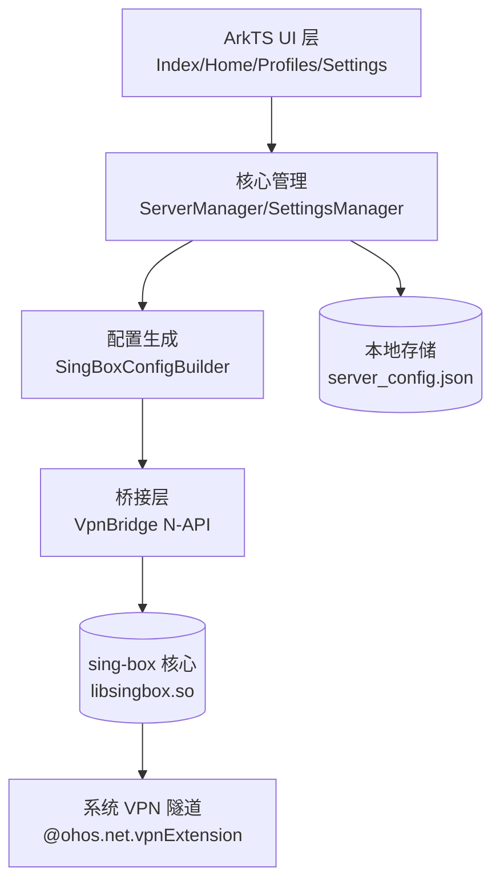

# karing-HM 项目设计文档

> 版本：v0.1.0（2026-09-18）· 状态：工程骨架
> 项目：Karing 的 HarmonyOS 移动版 · bundleName：`com.karing.hmos`
> 上游：https://github.com/KaringX/karing （GPL-3.0，Flutter + sing-box）

---

## 1. 项目概述

karing-HM 是开源代理客户端 [Karing](https://github.com/KaringX/karing) 的 HarmonyOS 移动版。
Karing 原版基于 Flutter + sing-box 内核，支持 Clash/V2ray/sing-box 订阅；本移植版采用
**ArkTS/ArkUI 重写 UI + sing-box 核心 native 化**的架构，聚焦手机/平板形态。

### 1.1 目标

- 在 HarmonyOS NEXT（API 22 / OpenHarmony 6.0.2）上提供完整的订阅管理、节点选择与代理连接能力
- 保持与 Karing 一致的交互心智：首页一键连接、订阅页管理、设置页分流
- 内核复用上游 sing-box（KaringX 魔改分支），保证协议兼容性

### 1.2 非目标（v0.1 裁剪范围）

- 不做桌面端（窗口/托盘/开机自启）
- 不做 tvOS / 遥控器模式
- 不做 WebDAV / iCloud / LAN 多端同步（后续版本迭代）
- 不做 Clash 完整配置解析（先支持订阅与 sing-box 原生配置）

---

## 2. 特性清单（v0.1）

| 模块 | 特性 | 状态 |
|------|------|------|
| 首页 | 一键连接/断开、当前分组与节点展示、连接状态 | ✅ 骨架 |
| 订阅 | 添加（URL/文本）、删除、分组列表、节点计数 | ✅ 骨架 |
| 解析 | base64 订阅、ss/vmess/vless/trojan/hy2/tuic URI、sing-box JSON | ✅ 实现 |
| 设置 | TUN/DNS/GeoIP/GeoSite 开关、日志级别、核心版本 | ✅ 骨架 |
| 核心 | sing-box 配置生成（outbound/route/dns/inbound） | ✅ 实现 |
| 桥接 | VpnBridge 状态机 + N-API 契约 | ⏳ 契约已定，native 待编 |
| VPN | 系统 VPN 隧道（vpnExtension） | ⏳ 依赖系统能力验证 |

---

## 3. C4 架构

### 3.1 C1 系统上下文



### 3.2 C2 容器



### 3.3 C3 组件

| 组件 | 职责 | 对应 Karing 源码 |
|------|------|-----------------|
| `ServerManager` | 分组 CRUD、订阅拉取、节点解析、持久化 | `lib/app/modules/server_manager.dart` |
| `SettingsManager` | 设置项状态、TUN/DNS/分流配置 | `lib/app/modules/setting_manager.dart` |
| `SubscriptionParser` | 订阅/URI 解析（ss/vmess/vless/trojan/hy2/tuic） | `lib/app/utils/`（私有） |
| `SingBoxConfigBuilder` | 生成 sing-box JSON 配置 | `lib/app/utils/singbox_config_builder.dart`（私有） |
| `VpnBridge` | 核心生命周期、状态机、native 调用 | `lib/app/local_services/vpn_service.dart`（私有） |
| `HomePage` | 连接开关 + 状态展示 | `lib/screens/home_screen.dart` |
| `ProfilesPage` | 订阅分组管理 | `lib/screens/my_profiles_screen.dart` |
| `SettingsPage` | 设置项 | `lib/screens/settings_screen.dart` |

### 3.4 C4 代码结构

```
harmony/
├── AppScope/                    # 应用级配置（bundleName 等）
└── entry/src/main/
    ├── module.json5             # 模块配置 + 权限声明
    ├── resources/               # 资源（图标/字符串/颜色/页面路由）
    └── ets/
        ├── entryability/EntryAbility.ets
        ├── pages/               # Index（Tab 导航）+ Home/Profiles/Settings
        ├── model/               # ProxyConfig / ServerConfigGroup
        ├── core/                # ServerManager / SettingsManager / SubscriptionParser / SingBoxConfigBuilder
        ├── bridge/              # VpnBridge（N-API 桥接）
        └── common/              # Constants / Logger
docs/
└── native-bridge-api.md         # sing-box native 桥接契约
```

---

## 4. 详细设计

### 4.1 订阅解析流程

```
订阅文本
 ├─ JSON → sing-box outbounds 解析
 ├─ base64 → 解码后按行解析
 └─ 逐行 URI（ss/vmess/vless/trojan/hy2/tuic）→ ProxyConfig[]
```

`SubscriptionParser.parseSubscription` 兼容四种输入形态；解析失败的行跳过，
不影响整组导入。

### 4.2 sing-box 配置生成

`SingBoxConfigBuilder.buildConfig()` 输出：

```jsonc
{
  "log": { "level": "info" },
  "dns": { "servers": [remote, local], "final": "remote" },
  "inbounds": [mixed-in, tun-in],
  "outbounds": [节点..., direct, block, dns-out, selector(proxy)],
  "route": { "rules": [dns, geosite-cn→direct, geoip-cn→direct], "final": "proxy" }
}
```

### 4.3 数据流（连接）

1. 首页点击连接 → `VpnBridge.connect(configJson)`
2. 生成配置 → 状态机 DISCONNECTED → CONNECTING
3. 拉起系统 VPN 隧道 → native 启动核心
4. 状态回调 → CONNECTED → UI 更新

### 4.4 持久化

- `filesDir/server_config.json`：分组元数据（节点列表不落盘，随订阅刷新）
- 格式：JSON，`{ currentGroupId, currentNodeTag, groups[] }`

---

## 5. 测试验证方案

### 5.1 单元测试（ohosTest / 后续补充）

| 用例 | 覆盖点 |
|------|--------|
| 解析 ss URI | base64 userinfo、明文、fragment 备注 |
| 解析 vmess | base64 JSON payload |
| 解析 vless/trojan | query 参数、sni、fp、path |
| 解析 hy2/tuic | password/sni |
| 解析 sing-box JSON | outbounds 过滤 internal 类型 |
| 配置生成 | outbound 完整性、selector 指向、rules 顺序 |
| 持久化 | 写入→读取→字段还原 |

### 5.2 构建验证

- ✅ `hvigorw assembleHap`（debug）构建成功，产出 `entry-default-unsigned.hap`
- ✅ 本地 CA 链签名成功（`sign.sh`），`verify-app` VERIFY OK
- ✅ 产物 `karing-HM-v0.1-signed.hap`（~721KB），bundleName=`com.karing.hmos`，API 22
- ⏳ native 库缺失时 VpnBridge 走降级路径（本地端口 + 系统代理）

### 5.3 手工验证清单

- [ ] 添加订阅 URL → 拉取 → 节点数正确
- [ ] 粘贴节点文本 → 解析 → 列表展示
- [ ] 切换分组 → 首页显示同步
- [ ] 点击连接 → 状态流转正确
- [ ] 设置项修改 → 配置生成生效
- [ ] 删除分组 → 数据持久化正确

---

## 6. 工程要求

1. **命名**：`karing-HM`，bundleName `com.karing.hmos`（遵循 *Lite-HM 规范）
2. **版本**：自 0.1 起递增，产出文件不覆盖旧版本
3. **兼容**：compileSdkVersion 22 / compatibleSdkVersion 6.0.2(22)，runtimeOS OpenHarmony
4. **权限最小化**：仅 INTERNET / NETWORK_INFO / SET_NETWORK_INFO / VPN / KEEP_BACKGROUND_RUNNING
5. **许可**：GPL-3.0（继承上游；不沿用 "karing" 名称与品牌）
6. **文档随开发迭代**：本文件 + README.md 持续更新

---

## 7. 风险与待办

| 风险 | 影响 | 对策 |
|------|------|------|
| sing-box 无法直接编译到 OHOS | 核心不可用 | 验证 NDK 交叉编译；降级为 libbox 类方案 |
| vpnExtension TUN 能力限制 | 无法全局代理 | mixed 端口 + 系统代理降级 |
| 上游 Karing 闭源私有模块（utils/local_services） | 无参考实现 | 按契约自行设计（已覆盖核心路径） |
| GPL-3.0 传染性 | 分发需开源 | 明确开源声明，不混入闭源代码 |
| ArkTS 严格语法（无索引签名/结构类型/组件不可 kit 导入） | 编译失败 | 全量 JsonMap + 显式变量构建配置；UI 组件全局可用 |

### v0.1 构建实测结论

- ArkTS 编译对**对象字面量**要求显式类型：`Record<string, Object>`（JsonMap）可用，
  interface 不可含索引签名，字段不可按索引访问
- `@kit.ArkUI` 只导出 API 类（window 等）；**UI 组件（Column/Text/Tabs/Divider 等）是全局符号**，
  从 kit 导入反而报 `not exported`
- 权限白名单：`ohos.permission.VPN` 非 SDK 预定义权限，删除后构建通过
  （VPN 能力经 vpnExtension API 申请，无需该权限声明）

### 后续迭代（v0.2+）

- [ ] 节点列表页 + 延迟测试
- [ ] 配置编辑（YAML/JSON 文本）
- [ ] WebDAV / ZIP 备份同步
- [ ] 流量统计图表
- [ ] 规则集自定义分组
