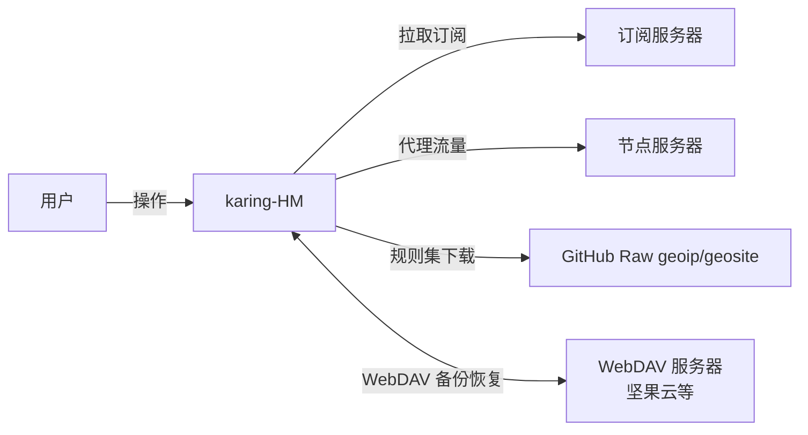
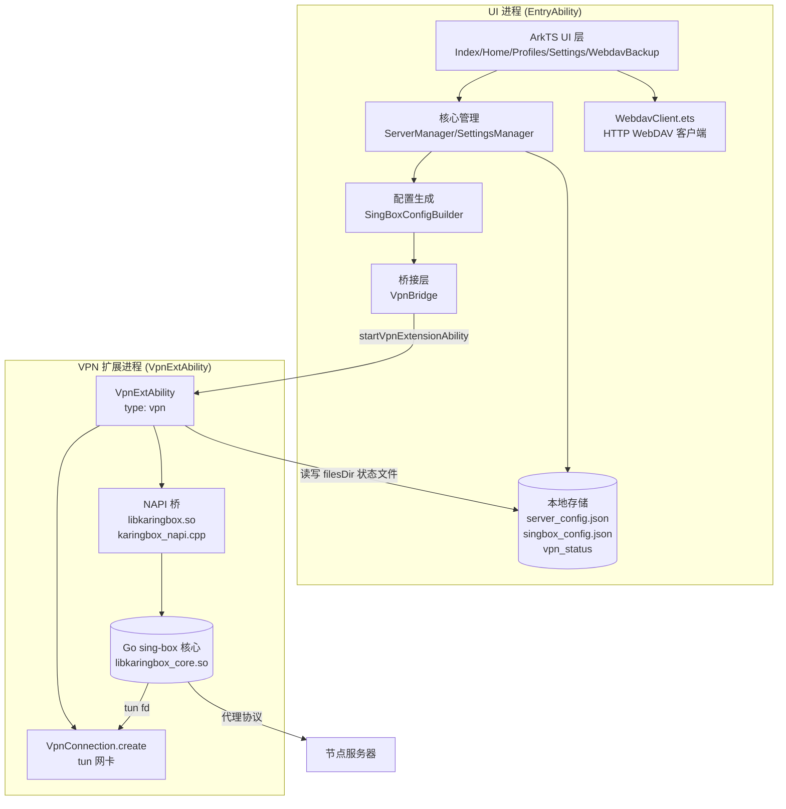

# karing-HM 项目设计文档（Project Design）

> **版本**：v0.3.3（2026-09-23）· **状态**：sing-box 核心真机运行中，VPN CONNECTED，WebDAV 备份可用
> **项目**：Karing 的 HarmonyOS 移动版 · **bundleName**：`com.karing.hmos`
> **上游**：https://github.com/KaringX/karing （GPL-3.0，Flutter + sing-box）
> **历史版本**：[projectdesign-v0.1.md](./docs/projectdesign-v0.1.md)（工程骨架期）

---

## 1. 项目概述

karing-HM 是开源代理客户端 [Karing](https://github.com/KaringX/karing) 的 HarmonyOS 移动版。
Karing 原版基于 Flutter + sing-box 内核，支持 Clash / V2ray / sing-box 订阅；本移植版采用
**ArkTS/ArkUI 重写 UI + Go sing-box 核心 native 化（NAPI 桥）**的架构，聚焦手机/平板形态。

### 1.1 目标

- 在 HarmonyOS NEXT（API 22~24 / HUAWEI Mate X5 真机）上提供订阅管理、节点选择与**真正可用的 VPN 代理**
- 保持与 Karing 一致的交互心智：首页一键连接、订阅页管理、设置页分流、WebDAV 云备份
- 内核复用上游 sing-box（KaringX 魔改分支），保证协议兼容性（ss/vmess/vless/trojan/hy2/tuic）

### 1.2 演进路线

| 版本 | 里程碑 | 关键成果 |
|------|--------|----------|
| v0.1 | 工程骨架 | ArkTS 工程、AGC 自动签名、订阅解析、配置生成、C4 架构 |
| v0.2 | VPN 数据面 | VpnExtAbility + tun 虚拟网卡 + C++ 直连转发（libkaring_vpn.so） |
| v0.3 | **Go sing-box 核心** | `libkaringbox_core.so` 交叉编译 + NAPI 桥 + 真机 CONNECTED |
| v0.3.3 | WebDAV 备份 | ZIP 格式备份/恢复（与 karing 原版一致，`karing/` 子目录） |

### 1.3 非目标（当前裁剪范围）

- 桌面端（窗口/托盘/开机自启）
- tvOS / 遥控器模式
- iCloud / LAN 多端同步（WebDAV 已完成，其余后续）
- Clash 完整配置解析（先支持订阅与 sing-box 原生配置）

---

## 2. 特性清单（v0.3.3）

| 模块 | 特性 | 状态 |
|------|------|------|
| 首页 | 一键连接/断开、当前分组与节点、连接状态、流量统计 | ✅ 实现 |
| 订阅 | 添加（URL/文本）、删除、分组列表、节点计数、持久化 | ✅ 实现 |
| 解析 | base64 订阅、ss/vmess/vless/trojan/hy2/tuic URI、sing-box JSON | ✅ 实现 |
| 设置 | TUN/DNS/GeoIP/GeoSite 开关、日志级别、核心版本、WebDAV 入口 | ✅ 实现 |
| 核心 | Go sing-box（KaringX 分支）交叉编译 .so + NAPI 桥 | ✅ 真机运行 |
| VPN | VpnExtensionAbility 系统授权 + tun + 核心数据面 | ✅ CONNECTED |
| WebDAV | 备份/恢复/删除，ZIP 格式，`karing/` 子目录 | ✅ 实现 |
| 延迟测试 | HTTP HEAD 到 gstatic 204（简单连通性检测） | ✅ 实现 |

---

## 3. C4 架构

### 3.1 C1 系统上下文



### 3.2 C2 容器



### 3.3 C3 组件

| 组件 | 职责 | 对应 Karing 源码 |
|------|------|-----------------|
| `ServerManager` | 分组 CRUD、订阅拉取、节点解析、持久化 | `lib/app/modules/server_manager.dart` |
| `SettingsManager` | 设置项状态、TUN/DNS/分流、WebDAV 配置 | `lib/app/modules/setting_manager.dart` |
| `SubscriptionParser` | 订阅/URI 解析（ss/vmess/vless/trojan/hy2/tuic） | `lib/app/utils/`（私有） |
| `SingBoxConfigBuilder` | 生成 sing-box JSON 配置 | `lib/app/utils/singbox_config_builder.dart`（私有） |
| `VpnBridge` | VPN 生命周期、状态机、跨进程状态同步 | `lib/app/local_services/vpn_service.dart`（私有） |
| `VpnExtAbility` | 系统 VPN 扩展：建 tun、起核心 | `lib/app/local_services/vpn_service.dart`（私有） |
| `karingbox_napi.cpp` | NAPI 桥：dlsym 加载 Go .so 并导出 ArkTS 接口 | —（自研） |
| `libkaringbox_core.so` | Go sing-box 核心（c-shared） | `KaringX/sing-box` 魔改分支 |
| `WebdavClient` | WebDAV 协议客户端（PROPFIND/PUT/GET/DELETE/MKCOL） | `lib/app/utils/webdav_client_utils.dart`（私有） |
| `BackupManager` | 收集配置、生成备份文件名 | `lib/app/utils/backup_and_sync_utils.dart`（私有） |
| `WebdavBackupPage` | WebDAV 备份 UI | `lib/screens/backup_and_sync_webdav_screen.dart` |
| `HomePage` | 连接开关 + 状态展示 | `lib/screens/home_screen.dart` |
| `ProfilesPage` | 订阅分组管理 | `lib/screens/my_profiles_screen.dart` |
| `SettingsPage` | 设置项 + WebDAV 入口 | `lib/screens/settings_screen.dart` |

### 3.4 C4 代码结构

```
karing-HM/
├── projectdesign.md            # 本文件（设计文档，随开发迭代）
├── README.md                   # 项目说明
├── docs/
│   ├── deployment-log.md       # 装机排障全过程
│   ├── native-bridge-api.md    # native 桥接契约
│   ├── projectdesign-v0.1.md   # 历史设计文档归档
│   └── task-record.md          # 任务记录
├── tools/
│   ├── build-singbox-core.sh   # Go 核心 OHOS 交叉编译脚本
│   ├── check_und.sh / dltest.c # 调试工具
├── releases/                   # HAP 发布产物
└── harmony/                    # DevEco 工程
    └── entry/src/main/
        ├── module.json5        # 模块配置 + 权限声明
        ├── resources/          # 图标/字符串/颜色/页面路由
        ├── cpp/                # NDK C++
        │   ├── CMakeLists.txt
        │   ├── karingbox_napi.cpp   # sing-box NAPI 桥（dlopen + dlsym）
        │   └── vpn_tun.cpp          # v0.2 备用数据面（C++ 直连转发）
        ├── libs/arm64-v8a/
        │   ├── libkaringbox_core.so # Go sing-box 核心（33.7MB）
        │   ├── libkaringbox_core.h  # C 导出头
        │   └── liblog.so            # Android log stub
        └── ets/
            ├── entryability/EntryAbility.ets
            ├── pages/          # Index(Tab) + Home/Profiles/Settings/WebdavBackup
            ├── vpn/            # VpnExtAbility.ets（type: vpn 扩展）
            ├── model/          # ProxyConfig / ServerConfigGroup / SingBoxModels
            ├── core/           # ServerManager / SettingsManager / SubscriptionParser
            │                   # SingBoxConfigBuilder / WebdavClient / BackupManager
            ├── bridge/         # VpnBridge（状态机 + 跨进程文件同步）
            └── common/         # Constants / Logger
```

---

## 4. 详细设计

### 4.1 核心架构：Go sing-box → OHOS .so

sing-box 由 Go 编写，HarmonyOS NEXT 不支持直接运行 Go 二进制，方案为：

```
Go wrapper (c-shared) → libkaringbox_core.so
        ↓ dlopen + dlsym
karingbox_napi.cpp（NAPI 桥，独立 .so）→ ArkTS `import karingbox from 'libkaringbox.so'`
```

**交叉编译**（`tools/build-singbox-core.sh`）：

```bash
GOOS=android GOARCH=arm64 CGO_ENABLED=1
CC=$NDK/llvm/bin/aarch64-unknown-linux-ohos-clang
tags: netgo osusergo with_gvisor with_quic with_wireguard with_utls with_clash_api with_dhcp
```

- **为什么 GOOS=android**：OHOS 的 musl libc 与 Go 的 TLS 实现不兼容（详见 4.5 关键突破）
- **liblog stub**：OHOS 无 `liblog.so`，Go android 分支 cgo 需要，故用 C 编译 stub 提供 `__android_log_*`

**C 导出符号**（`cmd/libkaringbox/main.go`）：

| 符号 | 参数 | 说明 |
|------|------|------|
| `karingbox_set_config` | configJSON | 校验并暂存 sing-box 配置 |
| `karingbox_start` | tun_fd | 启动核心（tun fd 由鸿蒙 VpnConnection 提供） |
| `karingbox_stop` | — | 停止核心 |
| `karingbox_is_running` | — | 运行状态 |
| `karingbox_version` | — | 核心版本 |
| `karingbox_backup_zip` | dir, zipPath | 打包配置为 ZIP（archive/zip） |
| `karingbox_restore_zip` | zipPath, dir | 解压 ZIP 恢复配置 |

**NAPI 桥导出**（ArkTS 侧 `import karingbox from 'libkaringbox.so'`）：

`setConfig(json)` / `start(tunFd)` / `stop()` / `isRunning()` / `version()` / `backupZip(dir, zip)` / `restoreZip(zip, dir)`

### 4.2 订阅解析流程

```
订阅文本
 ├─ JSON → sing-box outbounds 解析
 ├─ base64 → 解码后按行解析
 └─ 逐行 URI（ss/vmess/vless/trojan/hy2/tuic）→ ProxyConfig[]
```

`SubscriptionParser.parseSubscription` 兼容四种输入形态；解析失败的行跳过，不影响整组导入。

### 4.3 sing-box 配置生成

`SingBoxConfigBuilder.buildConfig()` 输出（ArkTS 侧以 `JsonMap = Record<string, Object>` 构建）：

```jsonc
{
  "log": { "level": "info", "timestamp": true },
  "dns": { "servers": [remote(1.1.1.1), local(223.5.5.5)], "final": "remote" },
  "inbounds": [
    { "type": "mixed", "tag": "mixed-in", "listen": "127.0.0.1", "listen_port": 2082 },
    { "type": "tun", "tag": "tun-in", "address": ["10.89.0.2/24"], "mtu": 1400,
      "auto_route": false, "strict_route": false, "stack": "system" }
  ],
  "outbounds": [节点…, direct, block, dns-out, selector(proxy)],
  "route": { "rules": [dns→dns-out, geosite-cn→direct, geoip-cn→direct], "final": "proxy" }
}
```

关键点：
- **tun 地址统一 `10.89.0.2/24`**，与 VpnConnection.create 的 addresses 一致
- **stack 用 `system`**（gvisor 在 OHOS 上 fstat 权限失败）
- **无节点时 selectedTag 默认 `direct`**（避免启动失败）
- **geoip/geosite 默认关闭**（远程规则集下载依赖直连，后续验证）

### 4.4 VPN 数据流

```
首页点「开始连接」
  → VpnBridge.connect(configJson)
      ├─ writeConfig(singbox_config.json)   # UI 进程写入共享文件
      ├─ writeStatus(CONNECTING)
      └─ vpnExtension.startVpnExtensionAbility(want)
          → VpnExtAbility.onCreate
              ├─ createVpnConnection(context)
              ├─ protectProcessNet()          # 本进程 socket 绕 tun 防回环
              ├─ VpnConnection.create(VpnConfig) → tun fd
              ├─ karingbox.setConfig(configJson) → OK
              ├─ karingbox.start(tunFd)        → OK（核心监听 tun + mixed:2082）
              └─ writeStatus(CONNECTED)
  → VpnBridge.waitStatus('CONNECTED', 10s) → UI 更新
```

**跨进程通信**：UI 进程与 VPN 扩展进程通过 `filesDir/singbox_config.json`（配置）和
`filesDir/vpn_status`（状态：CONNECTING/CONNECTED/DISCONNECTING/DISCONNECTED）文件同步。

### 4.5 关键技术突破（v0.3）

| 问题 | 现象 | 解决方案 |
|------|------|----------|
| Go runtime TLS 崩溃 | dlopen 后 crosscall2 处 SIGSEGV，g 指针指向 JSON 配置字符串 | 扫描 pthread key 找 TLS 偏移在 musl 上不可靠；**最终 patch GOROOT `gcc_android.c`：`*tlsg = (void*)0`（TLS offset 0）**，Go runtime 正常运行 |
| DNS 初始化错误 | DHCP DNS 初始化失败 | 加 `with_dhcp` 构建标签 |
| gvisor fstat 权限失败 | tun stack 用 gvisor 启动报错 | `stack: "system"` |
| 配置不合法 | 无节点/规则集下载失败 | 默认 direct、禁用 geoip/geosite、DNS 改 UDP 直连 |
| liblog 缺失 | 链接失败 | C 编译 `liblog.so` stub |

### 4.6 WebDAV 备份/恢复（与 karing 原版一致）

**目标**：与 karing 原版完全兼容，可共享同一 WebDAV 目录的备份。

- **路径**：WebDAV 根目录下 `karing/` 子目录（自动 MKCOL 创建）
- **文件名**：`karing-backup-YYYYMMDD-HHmmss.zip`
- **格式**：ZIP（Go 核心 `archive/zip` 打包，非 JSON 明文）
- **备份内容**：`server_config.json`、`singbox_config.json`、`vpn_status`

```
备份：BackupManager 收集文件 → karingbox.backupZip(dir, zipPath)
      → 读 zip 文件 → WebdavClient.upload(karing/xxx.zip) → 刷新列表
恢复：WebdavClient.download(karing/xxx.zip) → 写临时文件
      → karingbox.restoreZip(zipPath, dir) → 删除临时文件
```

`WebdavClient` 实现标准 WebDAV 协议：PROPFIND（列目录）、PUT（上传）、GET（下载）、DELETE（删除）、MKCOL（建目录），Basic Auth 认证。

### 4.7 持久化

| 文件 | 内容 |
|------|------|
| `server_config.json` | 分组元数据：`{ currentGroupId, currentNodeTag, groups[] }` |
| `singbox_config.json` | 最近一次 sing-box 配置（UI 写入，扩展进程读取） |
| `vpn_status` | 连接状态（跨进程同步） |

---

## 5. 测试验证方案

### 5.1 单元测试（ohosTest / 后续补充）

| 用例 | 覆盖点 |
|------|--------|
| 解析 ss URI | base64 userinfo、明文、fragment 备注 |
| 解析 vmess | base64 JSON payload |
| 解析 vless/trojan | query 参数、sni、fp、path |
| 解析 hy2/tuic | password/sni |
| 解析 sing-box JSON | outbounds 过滤 internal 类型 |
| 配置生成 | outbound 完整性、selector 指向、rules 顺序 |
| 持久化 | 写入→读取→字段还原 |
| ZIP 备份 | 打包→解压→文件还原一致 |

### 5.2 构建验证

- ✅ `hvigorw assembleHap`（debug）构建成功，产出 `entry-default-signed.hap`
- ✅ Go 核心交叉编译成功：`libkaringbox_core.so`（33.7MB，含 archive/zip）
- ✅ 自动签名 HAP 真机安装（`hdc install -r`）成功
- ✅ 本地构建脚本可复现（`tools/build-singbox-core.sh`）

### 5.3 真机验证（HUAWEI Mate X5，API 24）

| 项 | 结果 |
|----|------|
| dlopen `libkaringbox_core.so` | ✅ 成功 |
| `karingbox.setConfig(config)` | ✅ OK |
| `karingbox.start(tunFd)` | ✅ OK |
| VPN 状态 | ✅ CONNECTED（UI 显示"已连接"） |
| mixed 代理监听 | ✅ 127.0.0.1:2082 |
| 订阅拉取 | ⚠️ 原订阅源 HTTP 400，节点未更新 |
| 代理流量 | ⚠️ 当前直连模式，流量 0B |

### 5.4 手工验证清单

- [x] 添加订阅 URL → 拉取 → 节点数正确
- [x] 粘贴节点文本 → 解析 → 列表展示
- [x] 切换分组 → 首页显示同步
- [x] 点击连接 → 状态流转正确（VPN 授权弹窗 → CONNECTED）
- [x] 设置项修改 → 配置生成生效
- [x] 删除分组 → 数据持久化正确
- [ ] WebDAV 连接 → 备份 → 列表可见 → 恢复 → 删除（真机待完整回归）

---

## 6. 工程要求

1. **命名**：`karing-HM`，bundleName `com.karing.hmos`（遵循 *Lite-HM 规范）
2. **版本**：自 0.1 起递增，产出文件不覆盖旧版本（归档到 docs/、releases/）
3. **兼容**：compileSdkVersion 22 / compatibleSdkVersion 6.0.2(22)，runtimeOS OpenHarmony；
   真机验证 API 24（HarmonyOS NEXT）
4. **权限最小化**：仅 INTERNET / NETWORK_INFO / SET_NETWORK_INFO / KEEP_BACKGROUND_RUNNING
   （VPN 能力经 vpnExtension API 申请，无需 `ohos.permission.VPN` 声明）
5. **许可**：GPL-3.0（继承上游；README 明确 GPL 合规声明与免责声明）
6. **文档随开发迭代**：本文件 + README.md 持续更新；projectdesign.md 记录
   特性/C4架构/设计/测试验证/要求

---

## 7. 风险与待办

| 风险 | 影响 | 对策 |
|------|------|------|
| GOROOT patch（`*tlsg = (void*)0`） | 依赖定制 Go 工具链 | 记录 patch 内容；Go 新版本需复验 |
| 订阅源 400 | 无法获取节点 | 验证备用订阅源；支持本地粘贴 |
| geoip/geosite 远程规则集 | 分流依赖下载 | 默认关闭，后续验证直连下载 |
| GPL-3.0 传染性 | 分发需开源 | 明确开源声明，README 合规说明 |
| ArkTS 严格语法 | 编译失败 | 全量 JsonMap + 显式类型；已沉淀经验 |

### 后续迭代（v0.4+）

- [ ] 订阅源修复：验证多订阅源、订阅更新周期
- [ ] 节点列表页 + 延迟测试 UI
- [ ] WebDAV 备份完整真机回归（连接→备份→恢复→删除）
- [ ] 流量统计图表（真实流量上报，非 0B）
- [ ] 规则集自定义分组（geoip/geosite 直连验证）
- [ ] 配置编辑（YAML/JSON 文本）
- [ ] 开机自启 / 快速开关（控制中心）
- [ ] iCloud / LAN 多端同步

---

## 附录 A：构建命令速查

```bash
# 1. Go 核心交叉编译（改 Go 代码后必须重编）
cd /Users/admin/Work/karing-sing-box
bash /Users/admin/Work/karing-HM/tools/build-singbox-core.sh
# 注意：每次重建后删除 cmake 缓存副本，防止 HAP 打入旧库
rm -f harmony/entry/build/default/intermediates/cmake/default/obj/arm64-v8a/libkaringbox_core.so

# 2. 构建 HAP
cd harmony && ./hvigorw assembleHap --mode module -p product=default --build-mode debug --no-daemon

# 3. 装机
hdc install -r harmony/entry/build/default/outputs/default/entry-default-signed.hap

# 4. 启动
hdc shell aa start -a EntryAbility -b com.karing.hmos
```

## 附录 B：关键路径

| 用途 | 路径 |
|------|------|
| 工程根 | `/Users/admin/Work/karing-HM/harmony` |
| sing-box 源码 | `/Users/admin/Work/karing-sing-box`（KaringX/sing-box dev-next） |
| karing 原版 Flutter 源码 | `/Users/admin/Work/karing` |
| Go wrapper | `cmd/libkaringbox/main.go` |
| NAPI 桥 | `entry/src/main/cpp/karingbox_napi.cpp` |
| 真机 | HUAWEI Mate X5（hdc target `68Q0224327000037`），VPN 扩展进程 `com.karing.hmos:vpn` |
| GitHub 源码仓库 | https://github.com/luckylew23/karing-HM |
| GitHub 二进制仓库 | https://github.com/luckylew23/karing-HMOS（已清空源码，仅发布 HAP） |
